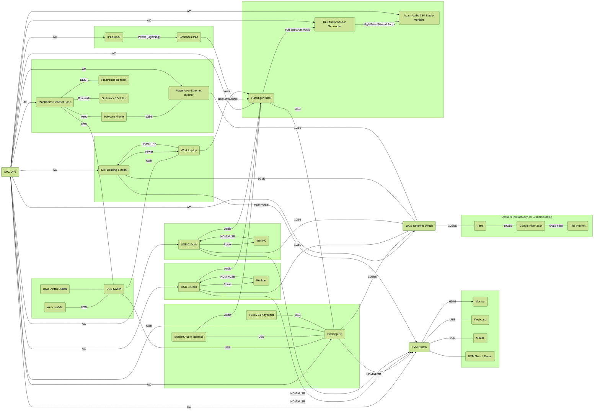

## Why is there such a crazy tangle of cables on Graham's desk?

Because there's a lot going on:

```mermaid
---
config:
    theme: forest
---
graph LR
    ups(APC UPS)
    ethersw(10Gb Ethernet Switch)
    ups--AC-->ethersw

    kvm(KVM Switch)
    subgraph sgkvm[ ]
        monitor(Monitor)
        kb(Keyboard)
        mouse(Mouse)
        kvmctl(KVM Switch Button)
    end
    kvm--HDMI-->monitor
    kvm--USB---kb
    kvm--USB---mouse
    kvm---kvmctl
    ups--AC-->kvm
    
    subgraph sgusb[ ]
        usbsw(USB Switch)
        usbctl(USB Switch Button)
        webcam(Webcam/Mic)
    end
    webcam--USB---usbsw
    usbctl---usbsw

    subgraph sgu["Upstairs (not actually on Graham's desk)"]
        terra(Terra)
        google(Google Fiber Jack)
        internet(The Internet)
    end
    ethersw--10GbE---terra
    terra--10GbE---google
    google--G652 Fiber---internet
    
    subgraph sgaudio[ ]
        mixer(Harbinger Mixer)
        spkrs(Adam Audio T5V Studio Monitors)
        sub(Kali Audio WS-6.2 Subwoofer)
    end
    mixer--Full Spectrum Audio -->sub
    sub--High Pass Filtered Audio -->spkrs
    ups--AC-->mixer
    ups--AC-->spkrs
    ups--AC-->sub

    subgraph sgipad[ ]
        ipad(Graham's iPad)
        ipaddock(iPad Dock)
    end
    ipad--Bluetooth Audio -->mixer
    ipaddock--"Power (Lightning)"-->ipad
    ups--AC-->ipaddock
    
    subgraph sgd[ ]
        desktop(Desktop PC)
        scarlett(Scarlett Audio Interface)
        flkey(FLKey 61 Keyboard)
    end
    desktop--HDMI+USB-->kvm
    ups--AC-->desktop
    usbsw--USB---desktop
    desktop--10GbE---ethersw
    scarlett--USB---desktop
    scarlett--Audio -->mixer
    ups--USB---desktop
    flkey--USB---desktop
    mixer--USB---desktop

    subgraph sgwm[ ]
        winmax(WinMax)
        winmaxdock(USB-C Dock)
    end
    winmax--HDMI+USB-->winmaxdock
    winmaxdock--Power-->winmax
    winmaxdock--HDMI+USB-->kvm
    winmaxdock--1GbE---ethersw
    winmaxdock--Audio -->mixer
    ups--AC-->winmaxdock

    subgraph sgmini[ ]
        minipc(Mini PC)
        minipcdock(USB-C Dock)
    end
    minipc--HDMI+USB-->minipcdock
    minipcdock--Power-->minipc
    minipcdock--HDMI+USB-->kvm
    minipcdock--1GbE---ethersw
    minipcdock--Audio -->mixer
    ups--AC-->minipcdock

    subgraph sglaptop[ ]
        laptop(Work Laptop)
        delldock(Dell Docking Station)
    end
    usbsw--USB---laptop
    laptop--HDMI+USB-->delldock
    delldock--HDMI+USB-->kvm
    delldock--1GbE---ethersw
    delldock--Power-->laptop
    laptop--Audio -->mixer
    ups--AC-->delldock
    
    subgraph sgphone[ ]
        polycom(Polycom Phone)
        polypoe(Power-over-Ethernet Injector)
        headbase(Plantronics Headset Base)
        headset(Plantronics Headset)
        s24(Graham's S24 Ultra)
    end
    polycom--1GbE---polypoe
    polypoe--1GbE---ethersw
    ups--AC-->polypoe
    headbase--DECT---headset
    headbase--wired---polycom
    headbase--Bluetooth---s24
    headbase--USB---usbsw
    ups--AC-->headbase
```               
